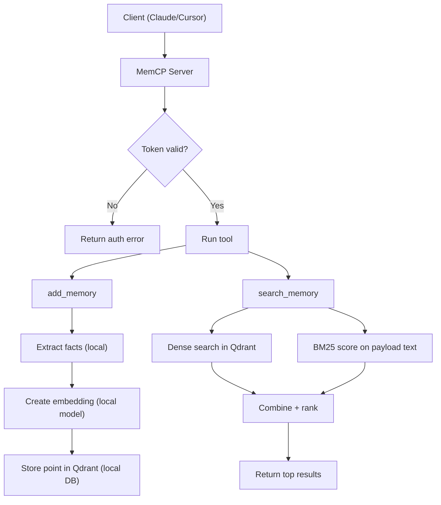

## 1) Auth Check
- If `MEMCP_AUTH_TOKEN` is configured, every tool call must pass `auth_token` with the same value.
- If missing/invalid, request fails with `PermissionError`.

## 2) add_memory: What gets stored
For each input memory, MemCP builds one Qdrant point:
- `id`: UUID
- `vector`: embedding of searchable text
- `payload`:
  - `content`
  - `atomic_facts`
  - `tags`
  - `user_id`
  - `source`
  - `created_at`

Storage location:
- `QDRANT_PATH` (default `~/.memcp/db`)
- Collection: `QDRANT_COLLECTION` (default `memories`)

## 3) Atomic Facts: Current implementation
Current logic is local and rule-based (no LLM):
1. If `ATOMIC_EXTRACT=false` -> `atomic_facts = [content]`
2. Else split input by sentence boundaries using regex: `(?<=[.!?])\s+`
3. Trim empty sentences
4. Keep first 5 sentences only
5. If split produces nothing -> fallback to `[content]`

So today, "atomic facts" are effectively sentence chunks, capped at 5.

## 4) Embedding text used for storage
- MemCP joins `atomic_facts` with newline: `"\n".join(atomic_facts)`
- That joined text is embedded using `sentence-transformers` with normalized embeddings.
- The resulting vector is stored in Qdrant.

## 5) search_memory: How candidates are found
Given query + optional filters (`tags`, `user_id`):
1. Embed query locally.
2. Dense retrieval from Qdrant with limit: `max(30, top_k * 4)`.
3. Also load all filtered payloads for lexical scoring (BM25 corpus).

## 6) BM25 text and tokenization
For each candidate payload used in BM25:
- Use text = joined `atomic_facts`; if absent, fallback to `content`.
- Tokenization regex: `[a-zA-Z0-9_\-]+` on lowercase text.
- BM25 raw scores are min-max normalized to `[0, 1]`:
  - `normalized = (score - min_score) / (max_score - min_score)`

## 7) Final hybrid score formula
Per memory ID:
- `dense = Qdrant dense similarity score` (or `0.0` if absent)
- `sparse = normalized BM25 score` (or `0.0` if absent)
- Final score:

`final_score = 0.7 * dense + 0.3 * sparse`

Results are sorted descending by `final_score`, and top `top_k` are returned.

## 8) Recovery by tool
- `search_memory`: returns ranked payloads + `score`
- `list_memories`: scroll + filter + sort by `created_at` desc
- `delete_memory`: delete by point ID
- `clear_memories`: delete all points or points by `user_id`
